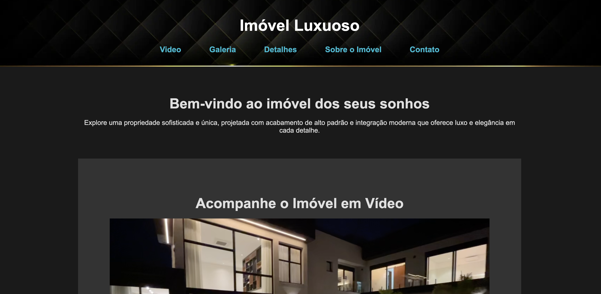

# 🏠 Elegant Mansion - Luxurious Real Estate Property

Welcome to **Elegant Mansion**, a sophisticated and unique luxury property designed with the highest standards of quality, blending modern architecture with the beauty of nature. This project showcases a modern, high-end mansion featuring the finest materials.

## Visual Overview

Here's the website interface:

---

## 🌐 Visit Our Website

For more details and to explore the website, [Click Here](https://cmontilha.github.io/ElegantMansion/).

---

## 📸 Gallery of Photos

Explore both **daytime** and **nighttime** views of the property in our photo gallery.

---

## 🌟 Website Features
- **Responsive Design**: Optimized for both desktop and mobile devices, ensuring a smooth user experience on all screen sizes.
- **Interactive Gallery**: High-quality images with a lightbox effect for a detailed view of each room and exterior.
- **Custom Animations**: Subtle animations to enhance the visual appeal and user interaction, including fade-in effects and hover transitions.
- **Contact Form**: A fully functional contact form for potential buyers to schedule a visit or request more information.
- **SEO Optimized**: Structured content and meta tags designed to improve visibility on search engines.
- **Elegant UI/UX**: A clean, minimalist interface with a focus on ease of navigation and a luxurious feel, reflecting the high-end nature of the property.

---

## Technology Stack

This project uses the following technologies:

- **HTML5**: For structured and semantic content.
- **CSS3**: Custom styles, grid layouts, and media queries for responsive design.
- **JavaScript**: Interactive elements and dynamic content handling.

---

## ⚠️ License & Attribution

¹ All values and features are subject to changes without prior notice.  
² Images used are owned by their respective creators and are copyrighted.
